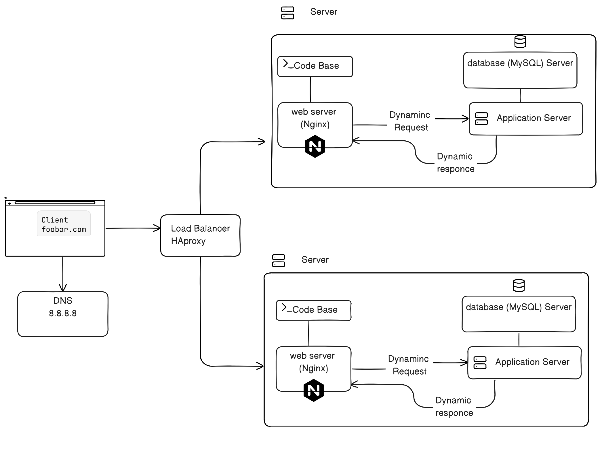

<strong> Distributed web infrastructure </strong>

What distribution algorithm the load balancer is configured with?

- One of the most common algorithms is Robin-Round algorithm in which traffic is going to the server in turn.

How it works ?

- Request is transmitted by load balancer to server in turn.

Is your load-balancer enabling an Active-Active or Active-Passive setup, explain the difference between both ?

- I may go to active active set up in which both servers are working, so that traffic is distributed between both guarding against overload on one only server.

<strong>How a database Primary-Replica (Master-Slave) cluster works?
What is the difference between the Primary node and the Replica node in regard to the application ?</strong>

- Master or primary replica is authenticated source of truth, main database with writing requests is applied, while replica node is read only copies of primary data base node.

<strong>What issues are with this infrastructure?</strong>

1 - High Cost
2 - Keeping data consistent may be challenging due to 2 interconnected database servers
3- Where are SPOF ?

- If load balancer used is failing, so incoming requests will fail to be transmitted and properly distributed
  4-Security issues (no firewall, no HTTPS) No monitoring
